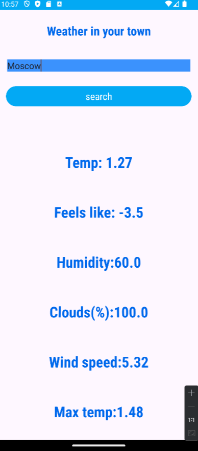

# Weather-viewer-android-app-
Андроид приложение на Java использующее погодное api openwathermap для определения погодных данных в разных городах мира.
Приложение использует api ключ openweathermap. Вы можете получить его сами зарегистрировав аккаунт на сайте сервиса.

Функционал и интерфейс приложения представлен на этом фото.
